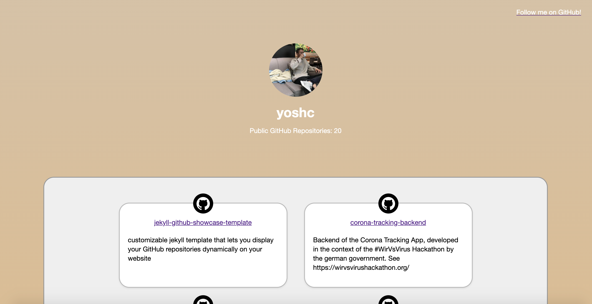

# jekyll-github-showcase-template

jekyll-github-showcase-template is a customizable jekyll template that lets you display your GitHub repositories dynamically on your website and create a showcase

# Live view
__Live view here:__ [LINK](https://jchristl.gitlab.io/jekyll-github-showcase-template/)

# Moved to GitLab
This project was moved to GitLab. [You can find it here.](https://gitlab.com/jchristl/jekyll-github-showcase-template)
